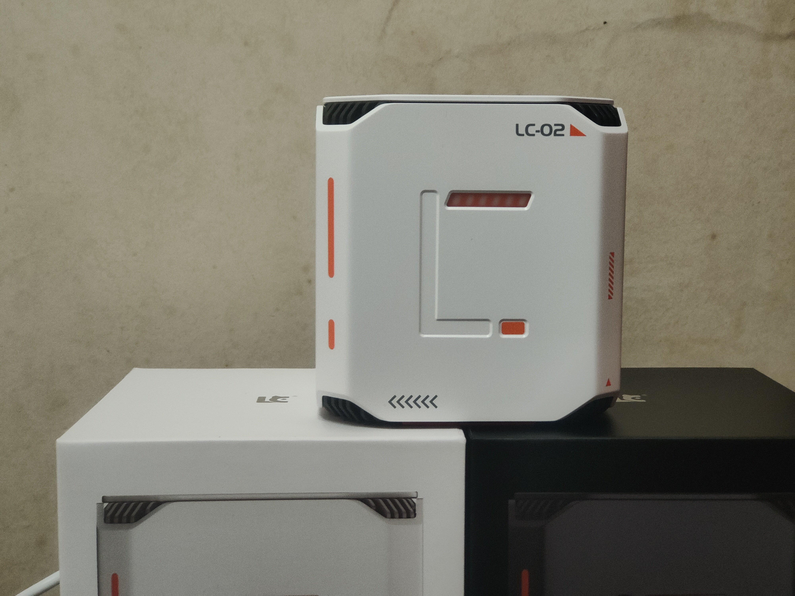

# LacyCatCloud

记录懒猫微服使用

# 什么是懒猫微服

个人感觉懒猫微服就是私有 AI + NAS +NUC + 私有云 + 云电脑

## 私有 AI

懒猫实验ollama

## NAS

1. 懒猫网盘

2. 懒猫相册

### NUC

接上键盘、鼠标、显示器，进虚拟机当小主机使用

## 私有云

自己开发应用，自己部署在上面，然后共享出去使用

## 云电脑

懒猫微服已经支持 Windows、 macOS、Android、Ubuntu、Debian、ArchLinux等虚拟机的开箱即用

1. Windows
2. macOS
3. Android
4. Ubuntu
5. Debian
6. ArchLinux

 
